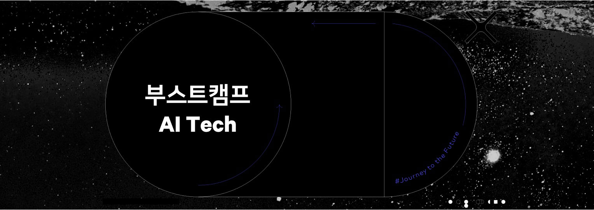
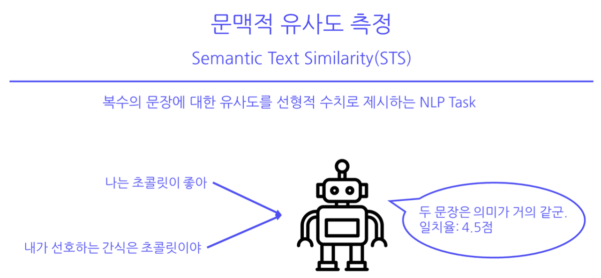

## :wave: Hello there!

This is :rocket: **Team NLP-09**'s repository for the first boostcamp AI Tech competition (2022.10.26 ~ 2022.11.03 19:00). 

The competition is on sentence-level Semantic Text Similarity, STS.

### **Data**

We are given a fixed train/dev/test dataset of ratio 85:5:10.

- Total \# of data: 10,974 sentence pairs
  - \# of train data: 9,324
  - \# of dev data: 1,100
  - \# of test data: 550

The data is from 3 sources:

1. petition (국민청원 게시판 제목 데이터)
2. NSMC (네이버 영화 감성 분석 코퍼스, Naver Sentiment Movie Corpus)
3. slack (업스테이지(Upstage) 슬랙 데이터)

Each sentence pair in train and dev datasets also include (1) a score from `0` to `5` where `0` indicates zero similarity while `5` indicates that the two sentences match in terms of their core and supplementary content and (2) a binary score where a score of less than 3 from the previous score is mapped to 0 and 1 otherwise.
<!--  -->